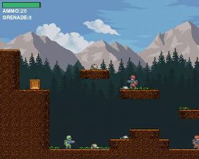
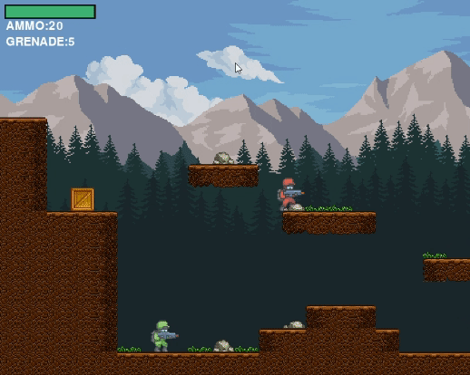
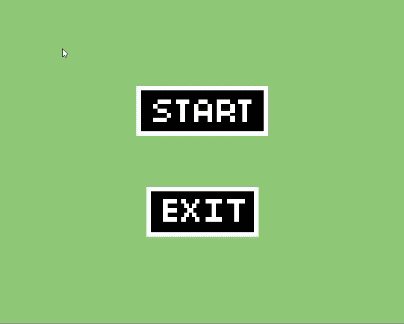
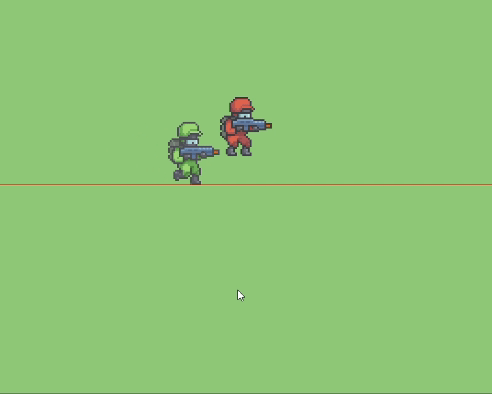
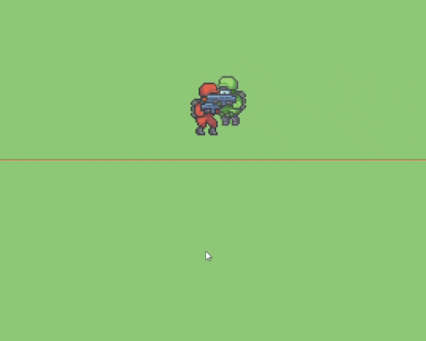
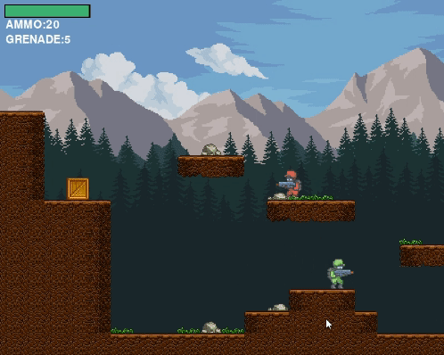

# -Shooter-Game
This is a simple shooter game developed using Pygame.

Overview
The Shooter Game is a side-scrolling action game where the player controls a character to navigate through levels, defeat enemies, and collect items. The game features smooth movement mechanics, shooting functionality, grenades, health packs, and more.

How to Play
Controls:

Use the A and D keys to move left and right, respectively.
Press W to jump.
Press SPACE to shoot bullets.
Press Q to throw grenades.
Objective:

Navigate through the levels, defeat enemies, and reach the exit.
Collect ammo boxes, health packs, and grenades to replenish resources.
Health Bar:

The health bar at the top left corner indicates the player's health.
Avoid enemy attacks and environmental hazards to maintain health.
Screenshots

Installation
To run the game locally, follow these steps:
Install Pygame:
Copy code
pip install pygame
Run the game:
Copy code
python main.py
Credits
Developed by Shruti Sonal

